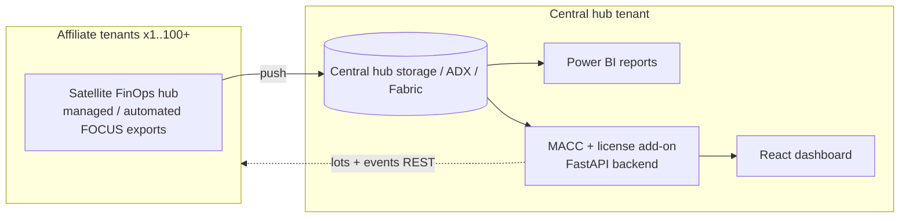

# Affiliate FinOps Platform

Centralized, self-service view of **affiliate Azure cost & MACC consumption** across many
tenants — built on the [FinOps toolkit](https://microsoft.github.io/finops-toolkit/)
(FinOps hubs) with a custom **MACC + license** add-on and a modern **React dashboard**
on top of a **FastAPI** backend.

> Full architecture & rationale: [`docs/affiliate-macc-cost-view-design.md`](docs/affiliate-macc-cost-view-design.md).

## What's in this repo

| Path | Purpose |
|---|---|
| `infra/` | Bicep modules + PowerShell onboarding automation (satellite hubs, managed/automated Cost Management exports, RBAC grants, affiliate registry). |
| `backend/` | FastAPI service: MACC puller (`Microsoft.Consumption/lots` + `events`), cost/affiliate/license APIs, demo-data provider so the dashboard runs without Azure. |
| `frontend/` | React 18 + TypeScript + Vite + Tailwind dashboard (Overview, Affiliates, MACC burn-down, Costs, Licenses). |
| `docs/` | Solution design. |

## Architecture (at a glance)



## Quick start (local, demo data — no Azure needed)

### Backend
```powershell
cd backend
python -m venv .venv; .\.venv\Scripts\Activate.ps1
pip install -r requirements.txt
copy .env.example .env            # USE_MOCK=true by default
uvicorn app.main:app --reload --port 8081
# http://localhost:8081/docs
```

### Frontend
```powershell
cd frontend
npm install
npm run dev                       # http://localhost:5174  (proxies /api -> :8000)
```

## Deploy (real environment)
See [`infra/README.md`](infra/README.md) for deploying the central hub, onboarding an
affiliate (`Onboard-Affiliate.ps1`), and switching the backend to live Azure
(`USE_MOCK=false`).

## Real vs. synthetic data (toggle)

`USE_MOCK` in `backend/.env` flips the whole backend between the deterministic
demo dataset and **real Azure Cost Management data** — no FinOps hub or ADX
cluster required for a single subscription.

| `USE_MOCK` | Source | Auth |
|---|---|---|
| `true` (default) | Synthetic demo data | none |
| `false` | Azure Cost Management (`DATA_BACKEND=azure`) | `az login` (DefaultAzureCredential) or an app registration |

With `USE_MOCK=false` and `DATA_BACKEND=azure` the backend:
- treats every **subscription** the signed-in identity can read as an *affiliate*
  (or just the ones in `AZURE_SUBSCRIPTION_IDS`),
- pulls up to `HISTORY_MONTHS` (~13) of monthly cost (actual + amortized),
  by-service, resource-level, and pricing-model data,
- categorises services, and builds the cost/breakdown/hierarchy/AI/TCO views
  from live spend,
- pulls **reservation (RI) + savings-plan recommendations** and **existing
  commitments** (reservation orders, savings plans) from the Azure Consumption /
  Cost Management / BillingBenefits APIs,
- reads **license seats** from Microsoft Graph `subscribedSkus` (valued via a
  price map), **MACC** commitment balances + drawdown from the Consumption
  `lots` / `events` APIs, **GitHub Copilot** seats/acceptance from the GitHub
  API, and **Azure OpenAI token** counts from Azure Monitor.

Each feed needs the matching read-only permission (below) and degrades to empty
— not an error — when it's missing, so the dashboard always renders.

| Feed | Source | Permission / config needed |
|---|---|---|
| Cost, breakdown, AI $, TCO, offer mix | Cost Management Query | Cost Management Reader on the subscription |
| RI / savings-plan recommendations & existing commitments | Consumption / CostManagement / BillingBenefits / Capacity | Reader / Cost Management Reader |
| Licenses & M365 Copilot seats | Microsoft Graph `subscribedSkus` | Graph **Organization.Read.All** (or Directory.Read.All) on the tenant |
| GitHub Copilot seats & acceptance | GitHub REST API | `GITHUB_TOKEN` (manage_billing:copilot) + `GITHUB_ORGS` / registry `github_orgs` |
| Azure OpenAI tokens | Azure Monitor metrics | Monitoring Reader (usually covered by Reader) |
| MACC | Consumption `lots` + `events` | **Billing Reader** on the billing account + `billing_account` in the registry |

Cost Management is heavily throttled (HTTP 429); the client retries with
exponential backoff + jitter and caches results for `CACHE_TTL_SECONDS`.

### Adding affiliates / tenants (scaling)

Affiliates are onboarded via **config, not code** — auto-discovery, an
`affiliates.json` registry (one affiliate can span multiple subscriptions/tenants),
or a central FinOps hub. See
[`docs/onboarding-affiliates.md`](docs/onboarding-affiliates.md). The dashboard
header shows a **Live Azure** / **Demo data** badge for the current mode.

Preview live numbers without starting the API:

```powershell
cd backend
az login
$env:USE_MOCK="false"
python -m app.live_smoke                                    # all subscriptions
python -m app.live_smoke <subscription-id>                 # just one
```

## Safety
- Read-only Azure access (Cost Management Reader / Billing Reader). No broker/live-write paths.
- Secrets via `.env` / Key Vault — never committed.

