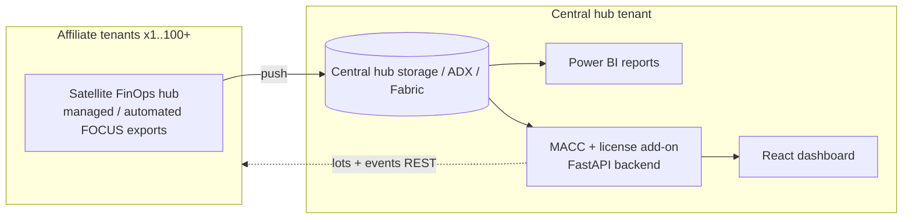

# Affiliate FinOps Platform

Centralized, self-service view of **affiliate Azure cost & MACC consumption** across many
tenants — built on the [FinOps toolkit](https://microsoft.github.io/finops-toolkit/)
(FinOps hubs) with a custom **MACC + license** add-on and a modern **React dashboard**
on top of a **FastAPI** backend.

> Full architecture & rationale: [`docs/affiliate-macc-cost-view-design.md`](docs/affiliate-macc-cost-view-design.md).

## What's in this repo

| Path | Purpose |
|---|---|
| `infra/` | Bicep modules + PowerShell onboarding automation (satellite hubs, managed/automated Cost Management exports, RBAC grants, affiliate registry). |
| `backend/` | FastAPI service: MACC puller (`Microsoft.Consumption/lots` + `events`), cost/affiliate/license APIs, demo-data provider so the dashboard runs without Azure. |
| `frontend/` | React 18 + TypeScript + Vite + Tailwind dashboard (Overview, Affiliates, MACC burn-down, Costs, Licenses). |
| `docs/` | Solution design. |

## Architecture (at a glance)



## Quick start (local, demo data — no Azure needed)

### Backend
```powershell
cd backend
python -m venv .venv; .\.venv\Scripts\Activate.ps1
pip install -r requirements.txt
copy .env.example .env            # USE_MOCK=true by default
uvicorn app.main:app --reload --port 8081
# http://localhost:8081/docs
```

### Frontend
```powershell
cd frontend
npm install
npm run dev                       # http://localhost:5174  (proxies /api -> :8000)
```

## Deploy (real environment)
See [`infra/README.md`](infra/README.md) for deploying the central hub, onboarding an
affiliate (`Onboard-Affiliate.ps1`), and switching the backend to live Azure
(`USE_MOCK=false`).

## Safety
- Read-only Azure access (Cost Management Reader / Billing Reader). No broker/live-write paths.
- Secrets via `.env` / Key Vault — never committed.

