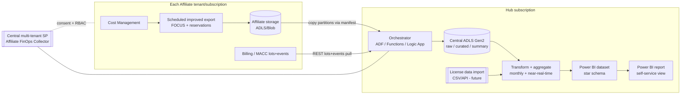
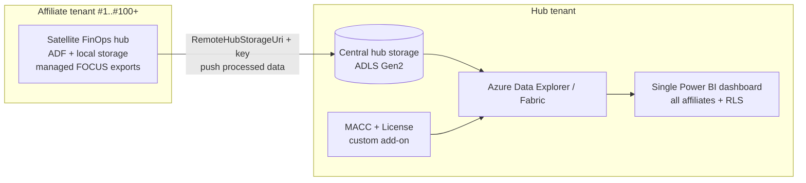

# Centralized Affiliate MACC & Cost Self‑Service View — Solution Design

## 1. Goal
A single, self‑service view for the customer that combines, per **affiliate**:
- **MACC status** — commitment amount, start/end dates, **remaining balance**, eligible spend (drawdown) and trend.
- **Cost/consumption** — aggregated Azure cost & usage (monthly/routine, with optional near‑real‑time).
- **License data** (future) — imported and joined to affiliates.

Delivered through central shared storage + Power BI (or equivalent), fed by a
**central identity (service principal)** that each affiliate grants access to, driving
**scheduled Cost Management exports** and **REST API data pulls**.

> 🟢 **RECOMMENDED APPROACH (added after review): don't build the pipeline from scratch — adopt the [FinOps toolkit](https://microsoft.github.io/finops-toolkit/) "FinOps hubs" as the backbone.** It is Microsoft's supported, maintained implementation of ~90% of this design (FOCUS exports → Data Factory ingestion → Azure Data Explorer/Fabric → Power BI), and its **remote (satellite) hub** pattern is purpose‑built for cross‑tenant scale to 100+ affiliates. Build custom only for the gaps: **MACC balance/burn‑down** and **license import**. See **Section 13** — it supersedes the custom pipeline in Sections 4/5/11 for everything except MACC + licenses.

---

## 2. Key facts that shape the design (from Microsoft Learn)

### Cost Management "improved" exports
- Support a **FOCUS** dataset (open FinOps spec) that **combines actual + amortized** cost, plus price sheets, reservation details/recommendations/transactions.
- **File partitioning** is on by default → each run emits multiple partitions + a **`manifest.json`** describing the full dataset (used to rejoin/ingest).
- **Overwrite** on for daily exports (replaces the day's month‑to‑date file).
- Frequencies for cost & usage: **one‑time**, **daily month‑to‑date**, **monthly (last month)**, **monthly (last billing month)**. Data available within ~4h of a run; all times **UTC**.
- Destination = **Azure Blob/ADLS** container + directory. A **system‑assigned managed identity** is created for the export and granted **Storage Blob Data Contributor** on the container (works if a **firewall** is later enabled).
- **Firewall + cross‑tenant caveat:** storage firewalls are supported only for storage in the **same tenant**; **firewalls are not supported for cross‑tenant exports**. Storage needs **"Permitted scope for copy operations = From any storage account"** and **Allow trusted Azure services**.
- Roles to create/manage exports: **Owner** (any scope) or **Contributor** (own exports). For firewalled storage the creator transiently needs **Owner** + `Microsoft.Authorization/roleAssignments/write` on the storage account.
- Exports REST API to write behind a firewall: use **api-version 2023-08-01+**.

### MACC tracking (REST API only — no PowerShell/CLI)
- List billing accounts: `GET https://management.azure.com/providers/Microsoft.Billing/billingAccounts?api-version=2020-05-01`
- MACC balances (lots): `GET .../billingAccounts/{billingAccountName}/providers/Microsoft.Consumption/lots?api-version=2021-05-01&$filter=source eq 'ConsumptionCommitment'`
  - Returns commitment amount, remaining balance, start/end/purchase dates, status (Active/Expired/Complete).
- MACC drawdown events: `GET .../billingAccounts/{billingAccountName}/providers/Microsoft.Consumption/events?api-version=2021-05-01&startDate=<>&endDate=<>&$filter=lotSource eq 'ConsumptionCommitment'`
- **Permissions:** EA → **Enterprise Administrator (reader)**; MCA → **Owner/Contributor/Reader on the billing account**. Reader is sufficient for tracking.

---

## 3. Identity model — the central decision

> ✅ **DECIDED:** Affiliates are **separate Entra ID tenants** (cross‑tenant). Using **Option A** below.
> ✅ **DECIDED:** Data movement = **affiliate‑hosted FOCUS exports + hub copy** (Section 5 / Section 11).

**Affiliates are separate Azure environments** (separate subscriptions and separate **Entra ID tenants**). Two viable patterns:

### Option A (SELECTED) — Multi‑tenant app + per‑affiliate consent
- Register **one multi‑tenant Entra app** ("Affiliate FinOps Collector") in the hub tenant.
- Each affiliate **admin‑consents** the app into their tenant, creating a local **service principal**.
- Each affiliate assigns that SP the least‑privilege roles they're comfortable with:
  - **Cost Management Reader** (or Reader) on the subscription/MG/billing scope → for API cost pulls & to let the SP create/read exports.
  - **Billing Reader / Enterprise Admin (reader)** on the billing account → for MACC lots/events.
  - **Contributor** on the export scope only if the SP itself will create the exports.
- **Data movement:** because exports can't write cross‑tenant into a firewalled hub store, each affiliate exports into **their own tenant's storage** (managed identity, firewall OK), then a hub pipeline **pulls/copies** partitions into central storage. Alternatively, the hub SP calls the **Cost Details/Query REST API** directly (no per‑affiliate storage needed) — simpler but rate‑limited and less rich than FOCUS exports.

### Option B — Per‑affiliate single‑tenant SPs
- One app registration per affiliate. More onboarding overhead; use only if a multi‑tenant app is disallowed.

**Recommendation:** Option A. Standardize onboarding with a **grant script / ARM‑Bicep template** the affiliate runs (consent + role assignments + export creation), so onboarding is repeatable and auditable. See the **Onboarding kit** in Section 11.

---

## 4. Target architecture



### Storage layout (central ADLS Gen2, medallion)
```
raw/
  affiliate=<id>/dataset=focus/yyyy=/mm=/dd=/<partitions>.csv.gz + manifest.json
  affiliate=<id>/dataset=reservations/...
  affiliate=<id>/dataset=macc-lots/yyyy-mm-dd.json
  affiliate=<id>/dataset=macc-events/yyyy-mm-dd.json
curated/   # cleaned, typed, deduped parquet, partitioned by affiliate + month
summary/   # monthly aggregates: cost by affiliate/service/tag, MACC remaining & burn-down
reference/ # affiliate master, license imports, currency, tag dictionary
```

---

## 5. Data acquisition

| Data | Method | Cadence | Notes |
|---|---|---|---|
| Cost & usage | Improved **export (FOCUS)** to affiliate storage → hub copy | Daily MTD + monthly close | Richest; uses partitions + `manifest.json`. Amortized + actual in one. |
| Cost & usage (alt / NRT) | **Cost Details / Query REST API** pull by hub SP | Daily or ad‑hoc | No per‑affiliate storage; good for near‑real‑time; watch throttling. |
| Reservation details/recs/transactions | Export datasets | Monthly | For amortization & optimization views. |
| **MACC lots** (balance) | REST `Microsoft.Consumption/lots` | Daily/weekly | Remaining balance, dates, status. |
| **MACC events** (drawdown) | REST `Microsoft.Consumption/events` | Monthly (post‑invoice) | Eligible spend that decrements MACC; drives burn‑down trend. |
| License data | CSV drop or source API → `reference/` | Ad‑hoc → scheduled later | Phase 2; join on affiliate key. |

**Orchestration options (pick one):**
- **Azure Data Factory** — best for copy + manifest‑driven ingestion + scheduling triggers.
- **Azure Functions (Python) + timer triggers** — best if you want code‑first REST pulls (MACC) and custom aggregation; aligns with a Python/FinOps codebase.
- **Logic Apps** — low‑code alternative for the REST/MACC pulls.
A common split: **ADF** for export‑file copy, **Functions** for MACC REST pulls and monthly summarization.

---

## 6. Aggregation & modeling
- **Monthly/routine summaries** materialized in `summary/` (cost by affiliate × service × resource group × tag; MACC remaining, monthly burn, projected exhaustion date).
- **Near‑real‑time**: incremental daily MTD refresh into `curated/`; Power BI **incremental refresh** on the fact table; optional **DirectQuery** against a SQL/Fabric endpoint for freshest numbers.
- **Star schema** for Power BI: `FactCost`, `FactMaccEvent`, `DimAffiliate`, `DimDate`, `DimService`, `DimTag`, `DimLicense`, plus a `MaccBalance` snapshot table for trend/burn‑down.

---

## 7. Reporting (Power BI) — the self‑service view
Pages: **Affiliate overview** (MACC status card: commitment, remaining, % consumed, days left, RAG status) · **Burn‑down & trend** (remaining vs time, projected exhaustion) · **Cost breakdown** (service/RG/tag, MoM) · **Reservations/savings** · **Licenses** (phase 2) · **Data freshness** (last export/pull per affiliate). Row‑level security by affiliate so each sees only their data if the report is shared outward.

---

## 8. Security & governance
- Central SP: **least privilege** (Reader / Cost Management Reader / Billing Reader); no write to affiliate resources beyond export management.
- Secrets in **Key Vault**; prefer **workload identity / federated credentials** over client secrets where possible.
- Central storage: **firewall + private endpoints**, RBAC not keys, `From any storage account` copy scope, trusted Azure services allowed.
- Full **onboarding audit** (who consented, which roles, when); offboarding = remove consent + role assignments (export MI role auto‑removes on delete).
- All export scheduling in **UTC**; normalize to the reporting timezone in the model.

---

## 9. Phased roadmap
1. **Foundation** — hub sub, central ADLS Gen2, Key Vault, multi‑tenant app registration, onboarding script/Bicep.
2. **Pilot (1–2 affiliates)** — FOCUS daily export + MACC lots/events pull → raw → curated → first Power BI page.
3. **Aggregation** — monthly summaries, burn‑down, projected exhaustion; data‑freshness page.
4. **Scale onboarding** — repeatable consent + RBAC across all affiliates.
5. **Near‑real‑time** — incremental refresh / DirectQuery via SQL or Microsoft Fabric.
6. **Licenses** — import + join; add license page.

---

## 10. Open questions to confirm
1. ~~**Tenancy**~~ — ✅ **Resolved: separate tenants (cross‑tenant).**
2. ~~**Export vs API‑only**~~ — ✅ **Resolved: affiliate‑hosted exports + hub copy.**
3. **Agreement type:** EA or MCA per affiliate? (Drives MACC roles + billing account scope.)
4. **Reporting platform:** Power BI Pro/PPU/Premium, or Microsoft **Fabric** (unlocks Lakehouse + DirectLake)?
5. **License source:** what system/format, and the join key to affiliate?
6. **Freshness SLA:** is daily good enough, or is intraday NRT required for phase 1?
7. **Hub copy transport:** affiliate grants hub SP **Storage Blob Data Reader** on their export container (pull), *or* affiliate pushes to hub via SAS? (Pull recommended.)

---

## 11. Onboarding kit (cross‑tenant, exports + hub copy)

Each affiliate runs a repeatable package (Bicep/PowerShell) that:

**A. Consent the hub multi‑tenant app** into the affiliate tenant (creates the local SP):
`https://login.microsoftonline.com/{affiliateTenantId}/adminconsent?client_id={hubAppId}`

**B. Assign least‑privilege RBAC** to that SP:
| Scope | Role | Why |
|---|---|---|
| Subscription (or MG) | **Cost Management Reader** | Read cost, create/read exports |
| Export target scope | **Contributor** *(only if SP creates the export)* | Create/update the scheduled export |
| Billing account (EA/MCA) | **Billing Reader** / EA **Enterprise Admin (reader)** | MACC lots + events |
| Affiliate export container | **Storage Blob Data Reader** (to hub SP) | Hub copy/pull |

**C. Provision the affiliate export storage** (ADLS Gen2 container, e.g. `finops-export`) with:
- `Permitted scope for copy operations = From any storage account`
- `Allow trusted Azure services` enabled (so the export MI works behind a firewall)

**D. Create the FOCUS export** (Exports REST API, **api‑version 2023‑08‑01+** for firewall support):
```http
PUT https://management.azure.com/{scope}/providers/Microsoft.CostManagement/exports/affiliate-focus-daily?api-version=2023-08-01
{
  "properties": {
    "schedule": { "status": "Active", "recurrence": "Daily",
      "recurrencePeriod": { "from": "2026-10-01T00:00:00Z", "to": "2030-01-01T00:00:00Z" } },
    "format": "Csv",
    "deliveryInfo": { "destination": {
      "resourceId": "/subscriptions/.../storageAccounts/<affiliateSA>",
      "container": "finops-export", "rootFolderPath": "focus" } },
    "definition": {
      "type": "FocusCost",
      "timeframe": "MonthToDate",
      "dataSet": { "granularity": "Daily", "configuration": { "dataVersion": "1.0" } }
    },
    "partitionData": true
  }
}
```
Add a second export for **monthly close** (`timeframe: TheLastMonth`) and optional **reservation** datasets.

**E. Hub ingestion (ADF / Functions), keyed off `manifest.json`:**
1. List affiliate containers (config‑driven registry of onboarded affiliates + storage resource IDs).
2. For each run folder, read **`manifest.json`** → enumerate partition blobs → **copy** into
   `raw/affiliate=<id>/dataset=focus/yyyy=/mm=/dd=/`.
3. **MACC pull** (hub Function, per affiliate): call `lots` + `events` REST with the SP token for that tenant → write JSON to `raw/.../macc-*`.
4. Transform → `curated/` (parquet) → `summary/` monthly aggregates → Power BI refresh.

**F. Onboarded‑affiliate registry** (drives the loop) — one row per affiliate:
`affiliateId, tenantId, subscriptionId, billingAccountName, agreementType, exportStorageResourceId, exportContainer, status`.

---

## 12. Suggested build order (next actions)
1. Generate the **onboarding Bicep + PowerShell** (Section 11 A–D) as reusable assets.
2. Stand up **hub ADLS Gen2** + **affiliate registry** (JSON/Cosmos/SQL).
3. Build the **manifest‑driven copy** pipeline (ADF) + **MACC pull** Function.
4. Build the **summary** transform + **Power BI** model (star schema + burn‑down + RLS).

> Note: Sections 12's steps 2–4 are **replaced by FinOps hubs** if you adopt Section 13 (recommended). Only the MACC + license pieces remain custom.

---

## 13. Recommended: build on the FinOps toolkit (FinOps hubs) — scale to 100+ affiliates

### 13.1 What FinOps hubs give you out of the box
A Bicep‑deployed platform = **Cost Management (FOCUS) exports → Azure Data Factory ingestion → Azure Data Explorer *or* Microsoft Fabric → prebuilt Power BI reports**, plus an optional Copilot/AI agent and Advisor recommendation ingestion. It directly implements the storage + pipeline + model + dashboard layers we scoped, and is maintained/upgraded by Microsoft.
- **Multi‑scope:** one hub instance monitors **many** EA billing accounts, MCA billing profiles, subscriptions, and resource groups via a `settings.json` `scopes` list. FOCUS also lets you fold in **AWS/GCP**.
- **Managed exports:** grant the hub's **Data Factory managed identity** cost access on a scope and it **creates + maintains the exports for you** — per‑affiliate setup drops to *one role grant + one `scopes` entry*. (⚠️ Managed exports are **not** supported for **MCA** billing accounts/profiles — those need manually‑created exports.)
- **Prebuilt Power BI** reports (storage or ADX/Fabric‑connected) → the single dashboard, with a **Data ingestion** report to monitor freshness per scope.
- **Cost:** ~**$120/mo** (single‑node ADX) or ~$300/mo (F2 Fabric) **+ ~$10/mo per $1M monitored spend** (≈$5/$1M without ADX/Fabric). Storage ≈ 20 GB per $1M.

### 13.2 Scaling to 100+ affiliates across separate tenants — the topology that fits
Because affiliates are **separate tenants**, the clean, documented pattern is **remote (satellite) hubs → one central hub**:



- Each affiliate tenant gets a **lightweight satellite hub** deployed from **one parameterized Bicep/PowerShell template** (`Deploy-FinOpsHub -RemoteHubStorageUri … -RemoteHubStorageKey …`). It collects that tenant's cost data locally and **pushes to the central hub's storage**. Requires hub **v0.4+**.
- The **central hub** ingests everything into **one ADX/Fabric** store → **one Power BI dashboard** for all affiliates (use **RLS** by affiliate for outward sharing).
- **Onboarding a new affiliate = run one template + grant the local hub MI cost access + add the scope.** Repeatable and low‑touch to 100+; no bespoke per‑affiliate pipeline code.

**Alternative (only if affiliates won't host any resources):** keep affiliates export‑only into their own storage and have the central hub/pipeline pull (Sections 5/11). More custom glue, weaker at 100+ scale — prefer satellites.

### 13.3 Permissions & least privilege
- **Satellite hub MI** (per affiliate): **Cost Management Contributor** on the subscription(s)/RG, or **Enterprise/Department reader** for EA, to let it manage exports. No standing human Owner rights after setup.
- **Cross‑tenant transfer:** remote hubs currently authenticate to central storage with a **storage account key** (`RemoteHubStorageKey`) — this is the main least‑privilege caveat. Mitigate: store the key in **Key Vault**, enable **private networking/peering** between hub and satellites, and **rotate keys** on a schedule (watch for future MI‑based support).
- **MACC** add‑on identity: **Billing Reader** (MCA) / **Enterprise Admin (reader)** (EA) on each billing account — read‑only.
- Central hub can run on a **private, isolated network** you govern.

### 13.4 The gaps you still build (small, additive)
FinOps hubs cover cost/usage, prices, reservations/savings plans, and Advisor recommendations — **not** MACC commitment tracking or licenses. Keep these as thin custom add‑ons that land in the **same central ADX/Fabric** so they join in the one dashboard:
1. **MACC balance & burn‑down** — the REST puller from Sections 2/11 (`Microsoft.Consumption/lots` + `events`), written to a `MaccBalance`/`FactMaccEvent` table. This is the piece the toolkit does *not* provide.
2. **License import** — CSV/API into a `reference/DimLicense` table, joined on affiliate key.
3. **Affiliate registry** — mapping tenant/billing account → affiliate for labeling + RLS.

### 13.5 Custom‑from‑scratch vs FinOps hubs
| Dimension | Custom pipeline (Sec 4/5/11) | **FinOps hubs (recommended)** |
|---|---|---|
| Time to first dashboard | Weeks (build ingestion, model, report) | Days (deploy Bicep, add scopes, open prebuilt report) |
| Scale to 100+ tenants | Bespoke loop + manifest copy to maintain | **Satellite→central** template, repeatable |
| Export upkeep | You maintain export creation | **Managed exports** (grant + `scopes` entry) |
| Ongoing maintenance | You own bugs + upgrades | Microsoft‑maintained, versioned upgrades |
| MACC + licenses | Custom (same) | **Custom add‑on (same, smaller)** |
| Data model / dashboard | Build yourself | **Prebuilt FOCUS reports** + extensible |
| Least‑privilege story | You design RBAC | Documented RBAC; caveat = remote‑hub storage key |

### 13.6 Revised roadmap
1. **Deploy central FinOps hub** (ADX or Fabric) in the hub tenant; register `Microsoft.CostManagementExports` + `Microsoft.EventGrid`; connect prebuilt Power BI.
2. **Pilot 1–2 affiliates** via a **satellite‑hub Bicep template** → data flows into central → validate the single dashboard.
3. **Add MACC + license add‑ons** into the same ADX/Fabric; extend the dashboard (burn‑down, projected exhaustion, license page).
4. **Templatize onboarding** (parameterized deploy + role grant + scope entry) and roll to all affiliates; add the affiliate registry + RLS.
5. **Harden** — Key Vault for remote keys, private networking, key rotation, freshness monitoring via the Data ingestion report.

### 13.7 Sources
- FinOps toolkit / hubs: https://microsoft.github.io/finops-toolkit/hubs
- Hubs overview: https://learn.microsoft.com/cloud-computing/finops/toolkit/hubs/finops-hubs-overview
- Configure scopes (multi‑scope + managed exports): https://learn.microsoft.com/cloud-computing/finops/toolkit/hubs/configure-scopes
- Configure remote (cross‑tenant satellite) hubs: https://learn.microsoft.com/cloud-computing/finops/toolkit/hubs/configure-remote-hubs
- MACC tracking (REST): https://learn.microsoft.com/azure/cost-management-billing/benefits/macc/track-consumption-commitment?tabs=rest

---

## 14. Full end‑to‑end automation — "manual" ≠ portal clicks

**Clarifying the MCA caveat.** FinOps hubs have a feature called **managed exports**: you grant the hub's Data Factory **managed identity** cost access and list scopes in `settings.json`, and the hub **creates + maintains the Cost Management exports for you**. That convenience feature is **not available for MCA billing accounts/profiles** (a Cost Management limitation) — and also isn't the model you'd use cross‑tenant where the hub MI can't reach another tenant.

**What "manually created" really means here = "you create the export yourself, but via code."** It does **not** require the portal. The Cost Management **Exports** resource is fully automatable through all of these surfaces, at **any** scope including **MCA billing profile**:

| Surface | How | Notes |
|---|---|---|
| **REST API** | `PUT .../providers/Microsoft.CostManagement/exports/{name}?api-version=2023-08-01` (or `2025-03-01`) | Works behind storage firewall with `2023-08-01+`. Scope can be sub, RG, MG, EA billing account, **MCA billing profile**. |
| **ARM / Bicep** | `Microsoft.CostManagement/exports` resource | Declarative; deploy as an **extension resource** on the target scope. GitOps‑friendly. |
| **FinOps toolkit PowerShell** | `New-FinOpsCostExport` + `Start-FinOpsCostExport -Backfill` | Handles FOCUS + backfill + throttling. Tested on `2025-03-01`, `2023-08-01`. |
| **Azure SDK** | e.g. Python `azure-mgmt-costmanagement` → `exports.create_or_update()` | For code‑first orchestration (Functions/CI). |

**Automation decision per affiliate type:**
- **EA billing account / subscriptions / RGs / departments** → use FinOps hubs **managed exports** (grant hub MI + add `scopes` entry). Zero export code.
- **MCA billing profiles** (and any scope where managed exports don't apply) → **automate export creation** via Bicep/REST/PowerShell/SDK in the onboarding template. Still zero manual clicks.

Net: **no portal step anywhere** — EA is grant‑based managed exports; MCA is code‑created exports. Both are driven by the single onboarding template in Section 15.

---

## 15. Onboarding assets (automation skeletons)

> One parameterized package per affiliate, run by their admin (or via a central pipeline with delegated rights). Idempotent — safe to re‑run. These are **skeletons** to implement, not final code.

### 15.1 Satellite hub deploy (per affiliate tenant)
```powershell
# Deploy-Satellite.ps1  — deploys a satellite FinOps hub that pushes to the central hub.
param(
  [string]$AffiliateId, [string]$Location = 'eastus',
  [string]$ResourceGroup = "rg-finops-$AffiliateId",
  [string]$RemoteHubStorageUri,                     # central hub Data Lake dfs endpoint
  [securestring]$RemoteHubStorageKey                # central hub storage key (from Key Vault)
)
Import-Module FinOpsToolkit
New-AzResourceGroup -Name $ResourceGroup -Location $Location -Force
Deploy-FinOpsHub `
  -Name "finops-$AffiliateId" -ResourceGroup $ResourceGroup -Location $Location `
  -RemoteHubStorageUri  $RemoteHubStorageUri `
  -RemoteHubStorageKey  $RemoteHubStorageKey        # requires hub v0.4+
```

### 15.2 Grant managed‑export access (EA / subscription affiliates)
```powershell
# Grant the satellite hub's Data Factory MI cost access, then add the scope to settings.json.
# MI id + tenant come from: hub RG > Deployments > hub > Outputs (managedIdentityId / ...TenantId)
New-AzRoleAssignment -ObjectId $hubManagedIdentityObjectId `
  -RoleDefinitionName 'Cost Management Contributor' -Scope $SubscriptionScope
# EA enrollment/department: assign EnrollmentReader per assign-roles-azure-service-principals guide.
# settings.json (config container):  { "scopes": [ { "scope": "<scope-id>" } ] }
```

### 15.3 Automated export creation (MCA billing profile — no managed exports)
**Option A — FinOps toolkit PowerShell (recommended, handles backfill):**
```powershell
New-FinOpsCostExport -Name "ftk-$AffiliateId-focus" `
  -Scope "/providers/Microsoft.Billing/billingAccounts/$BA/billingProfiles/$BP" `
  -StorageAccountId $SatelliteStorageId -StorageContainer 'msexports' `
  -Dataset 'FocusCost' -DatasetVersion '1.0r2' `
  -StorageContainerPath "billingProfiles/$BP" `
  -Backfill 12 -Execute        # creates daily MTD export + backfills 12 months
# Repeat with -Dataset 'PriceSheet' / 'ReservationDetails' / 'ReservationRecommendations' / 'ReservationTransactions'
```
**Option B — Bicep (declarative, GitOps):**
```bicep
// export.bicep — deploy as extension resource on the MCA billing profile scope
targetScope = 'tenant'                       // billing profile is a tenant-level extension scope
param billingProfileScope string             // /providers/Microsoft.Billing/billingAccounts/{ba}/billingProfiles/{bp}
param storageAccountId string
resource focusExport 'Microsoft.CostManagement/exports@2023-08-01' = {
  name: 'ftk-focus-daily'
  scope: tenantResourceId... // bind to billingProfileScope
  properties: {
    schedule: { status: 'Active', recurrence: 'Daily'
      recurrencePeriod: { from: '2026-10-01T00:00:00Z', to: '2030-01-01T00:00:00Z' } }
    format: 'Parquet'
    partitionData: true
    deliveryInfo: { destination: { resourceId: storageAccountId, container: 'msexports', rootFolderPath: 'billingProfiles' } }
    definition: { type: 'FocusCost', timeframe: 'MonthToDate', dataSet: { granularity: 'Daily', configuration: { dataVersion: '1.0r2' } } }
  }
}
```
> Same pattern via **REST** (`PUT .../Microsoft.CostManagement/exports/{name}?api-version=2023-08-01`) or **Python SDK** (`CostManagementClient.exports.create_or_update`) if you prefer a code‑first Function.

### 15.4 MACC + license add‑on (the toolkit gap) — code‑first puller
```python
# macc_puller.py — runs in a central Function (timer). One credential per affiliate tenant
# (multi-tenant app client-credentials). Writes JSON/parquet to central ADLS -> ingest to ADX/Fabric.
from azure.identity import ClientSecretCredential
import requests

def pull_macc(tenant_id, billing_account, cred: ClientSecretCredential, start, end):
    tok = cred.get_token("https://management.azure.com/.default").token
    h = {"Authorization": f"Bearer {tok}"}
    base = f"https://management.azure.com/providers/Microsoft.Billing/billingAccounts/{billing_account}"
    lots   = requests.get(f"{base}/providers/Microsoft.Consumption/lots",
               params={"api-version":"2021-05-01","$filter":"source eq 'ConsumptionCommitment'"}, headers=h).json()
    events = requests.get(f"{base}/providers/Microsoft.Consumption/events",
               params={"api-version":"2021-05-01","startDate":start,"endDate":end,
                       "$filter":"lotSource eq 'ConsumptionCommitment'"}, headers=h).json()
    # -> write to central ADLS: reference/MaccBalance + fact/FactMaccEvent (partition by affiliate, date)
    return lots, events
# License import: land CSV/API -> reference/DimLicense keyed on affiliateId. Join in Power BI/ADX.
```

### 15.5 One‑command onboarding (the scale primitive)
```powershell
# Onboard-Affiliate.ps1 — the single repeatable action to add an affiliate (EA or MCA)
param($AffiliateId,$TenantId,$AgreementType,$BillingAccount,$BillingProfile,$SubscriptionId)
# 1) deploy satellite hub (15.1)
# 2) if EA/subscription -> grant hub MI + settings.json scope (15.2)   [managed exports]
#    if MCA            -> New-FinOpsCostExport / Bicep export (15.3)   [automated self-managed]
# 3) grant MACC add-on identity Billing Reader on the billing account
# 4) upsert row into the affiliate registry (affiliateId,tenantId,agreementType,billingAccount,billingProfile,status)
```
**Scale story:** onboarding 1 or 100 affiliates is the same command in a loop over a CSV of affiliates — no portal, no bespoke pipeline per affiliate. All data converges on one central hub → one Power BI dashboard with per‑affiliate RLS.

### 15.6 Automation sources
- Exports REST API: https://learn.microsoft.com/rest/api/cost-management/exports/create-or-update
- Exports ARM/Bicep resource: https://learn.microsoft.com/azure/templates/microsoft.costmanagement/exports
- `New-FinOpsCostExport`: https://learn.microsoft.com/cloud-computing/finops/toolkit/powershell/cost/new-finopscostexport
- `Start-FinOpsCostExport`: https://learn.microsoft.com/cloud-computing/finops/toolkit/powershell/cost/start-finopscostexport
- `Deploy-FinOpsHub`: https://learn.microsoft.com/cloud-computing/finops/toolkit/powershell/hubs/deploy-finopshub


---

## 16. Dashboard application (self-service UI on top of Power BI)

Beyond the prebuilt Power BI reports, this repo ships a purpose-built **self-service web app**
so affiliate owners can explore everything in one modern UI without opening Power BI.

**Backend** — FastAPI (`backend/`), Pydantic v2, provider abstraction (`USE_MOCK` demo data
vs `LiveDataProvider` over ADX/Fabric + MACC puller). Endpoints under `/api/v1`:
`health, summary, affiliates, affiliates/{id}/breakdown, affiliates/{id}/resources,
affiliates/{id}/hierarchy, macc/balances, macc/{id}, costs, licenses, rate-optimization,
prepayment, offer-mix, ai-consumption, tco`.

**Frontend** — React 18 + TS + Vite + Tailwind + TanStack Query + Recharts (`frontend/`).
Dark control-center sidebar + white content shell; shared theme tokens in `lib/theme.ts`.
Pages: Overview, Affiliates (+ resource drill-down detail), Billing Hierarchy, MACC,
Cost & Usage, Total Cost (TCO), Rate Optimization, AI & Copilot, Licenses. Analytics pages
carry a per-affiliate filter (portfolio-wide by default).

**Run (demo):** backend `uvicorn app.main:app --port 8081`; frontend `npm run dev` (:5174,
proxies `/api` -> :8081). Helpers: `run_backend.bat`, `run_frontend.bat`, `run_all.bat`.

## 17. Analytics slices (A-E) and how they map to data

| Slice | UI | Live-mode source |
|---|---|---|
| Resource drill-down | Affiliate detail: ServiceCategory -> Service -> ResourceType -> Resource | FOCUS `ServiceCategory/ServiceName/x_ResourceType/ResourceId` |
| **A** Rate optimization | Reservation recs + savings-plan KPIs + savings-by-service | FinOps hubs `ReservationRecommendations` + savings-plan datasets |
| **B** MACC & prepayment + offer mix | Balance vs utilized, commit-to-consume, prepayment; invoiced usage by offer type | Consumption `lots`/`events` + FOCUS `x_PricingModel`/offer |
| **C** Billing hierarchy | BillingProfile -> InvoiceSection -> Subscription -> ResourceGroup -> Resource tree | FOCUS `x_BillingProfileId/x_InvoiceSectionId/SubAccountId/ResourceGroupName/ResourceId` |
| **D** AI & Copilot | AI cost, tokens, seats, acceptance; by-source with data origin | See Section 18.2 |
| **E** TCO | Azure + external licenses + external Copilot, stacked | FOCUS cost + license feed + GitHub/Graph |

## 18. Answers folded in (Q4-Q6)

### 18.1 Do licenses roll up into Cost & Usage? (Q4)
- Marketplace / first-party offers billed on the **Azure invoice** appear in FOCUS cost data
  automatically (`ChargeCategory`, `PublisherType`, SKU meters).
- **M365 / Power BI / GitHub / VS** licenses are billed via **M365/MCA commerce, not Azure
  Cost Management**, so they do NOT appear in FOCUS -> kept as a separate imported feed.
- The **TCO** view (Slice E) unions Azure + external licenses + external Copilot with a
  `source` dimension, without double-counting Azure-billed AI.

### 18.2 Token consumption: GitHub Copilot / other copilots / Foundry (Q5)
| Source | $ cost | Usage/quantity |
|---|---|---|
| Azure OpenAI / AI Foundry | FOCUS (metered) | Azure Monitor token metrics |
| Security Copilot / Fabric Copilot | Azure (SCU / Fabric CU meters in FOCUS) | Azure Monitor |
| GitHub Copilot | GitHub billing API (or Azure metered billing if configured) | Copilot Metrics API (`/orgs/{org}/copilot/metrics`), seats |
| M365 Copilot | M365 commerce (license feed) | Microsoft Graph usage reports |

The **AI & Copilot** page surfaces all of these with a per-row **data origin** so the
collection path is explicit.

### 18.3 Granularity like the Microsoft ACR/MACC field reports (Q6)
- Customer hierarchy, MACC & prepayment balance, invoiced usage, reservations, savings plans,
  and price sheets are all reproducible from **FOCUS exports + Consumption lots/events +
  FinOps hubs reservation/savings datasets** (Slices A, B, C).
- **Caveat:** *ACR Allocation across TPIDs* and *offer-type mix (FieldLed/CustomerLed/
  Government)* are **Microsoft-internal partner constructs (MSX / Azure Customer Graph)** —
  not customer-facing APIs. The customer-facing analog is cross-affiliate cost allocation +
  pricing-model/offer mix (`x_PricingModel`, `x_SkuOfferId`), which the platform provides.
